---
## Front matter
lang: ru-RU
title: Презентация по лабораторной работе №4
author:
  - Еремина О.А.
institute:
  - Российский университет дружбы народов, Москва, Россия

## i18n babel
babel-lang: russian
babel-otherlangs: english

## Formatting pdf
toc: false
toc-title: Содержание
slide_level: 2
aspectratio: 169
section-titles: true
theme: metropolis
header-includes:
 - \metroset{progressbar=frametitle,sectionpage=progressbar,numbering=fraction}
 - '\makeatletter'
 - '\beamer@ignorenonframefalse'
 - '\makeatother'
---

## Цель работы

Целью данной лабораторной работы является получение навыков правильной работы с репозиториями git.

## Задание

- Выполнить работу для тестового репозитория.
- Преобразовать рабочий репозиторий в репозиторий с git-flow и conventional commits.

## Выполнение лабораторной работы

# Установка программного обеспечения

# Установка git-flow

Так как у меня ubuntu, то я устанавливаю ПО с помощью другой команды. (рис.1)

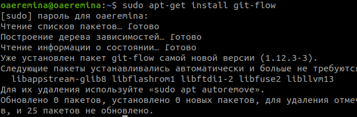{#fig:001 width=70%}

# Установка Node.js

То же самое делаю и для node.js (рис.2)

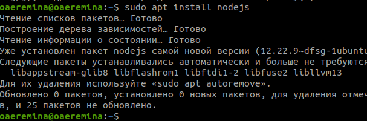{#fig:001 width=70%}

# Настройка Node.js

Для работы с Node.js добавляю каталог с исполняемыми файлами, устанавливаемыемыми yarn, в переменную PATH (рис. 3)

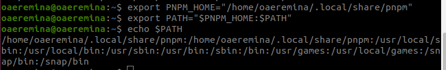{#fig:001 width=70%}

# Общепринятые коммиты

# commitizen

Данная программа используется для помощи в форматировании коммитов. При этом устанавливается скрипт git-cz, который я буду использовать для коммитов. (рис.4)

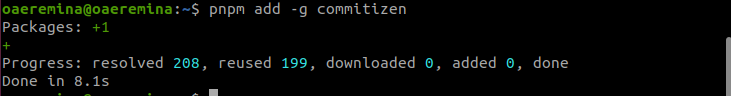{#fig:001 width=70%}

# standard-changelog

Данная программа используется для помощи в создании логов. (рис.5)

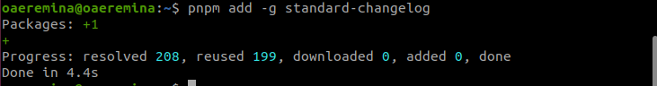{#fig:001 width=70%}

# Практический сценарий использования git

Создаю репозиторий с именем  git-extended. (рис.6)

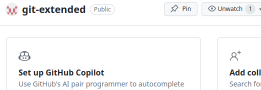{#fig:001 width=70%}

# Переходу в папку work и клонирую репозиторий в папку (рис.7)

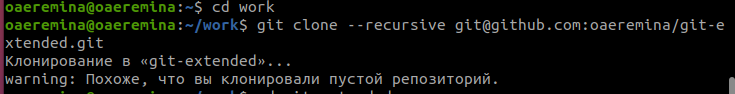{#fig:001 width=70%}

# Делаю первый коммит и выкладываю на github. (рис.8)

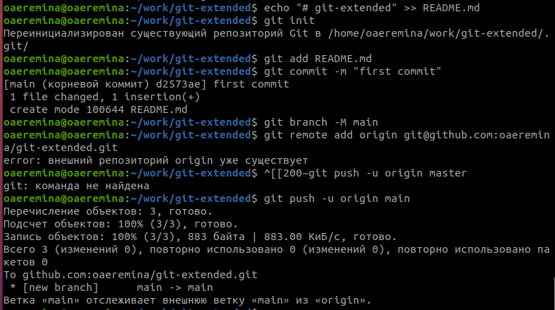{#fig:001 width=70%}

# Конфигурация для пакетов Node.js с помощью команды pnpm init (рис.9)

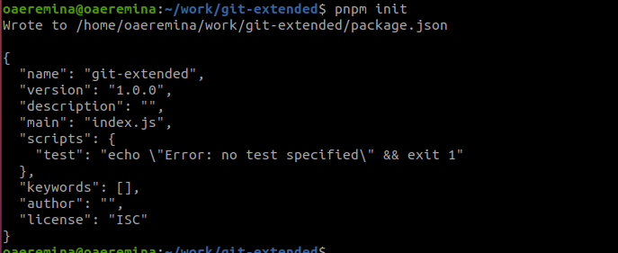{#fig:001 width=70%}

# Заполняю несколько параметров пакеты (рис.10)

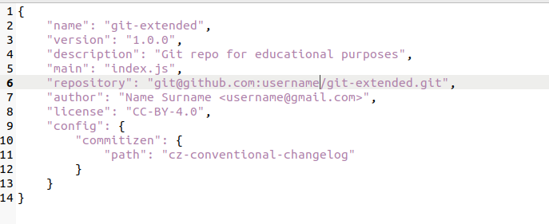{#fig:001 width=70%}

# Добавляю новые файлы, выполняю коммит и отправляю на github (рис.11)

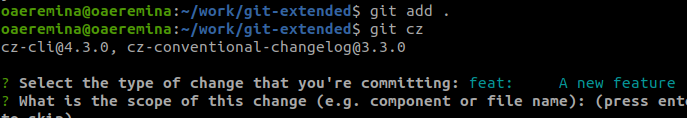{#fig:001 width=70%}

# Инициализирую git-flow (рис.12)

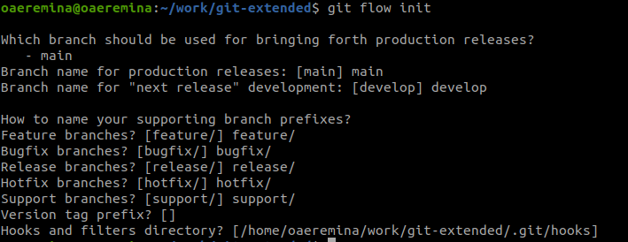{#fig:001 width=70%}

# Проверяю, что нахожусь на ветке develop и загружаю весь репозиторий в хранилище (рис.13)

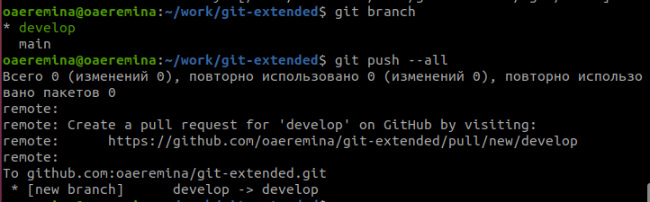{#fig:001 width=70%}

# Установливаю внешнюю ветку как вышестоящую для этой ветки (рис.14)

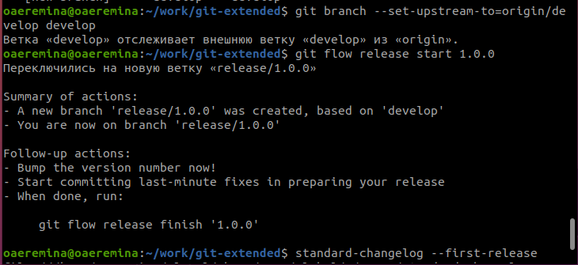{#fig:001 width=70%}

## Выводы

При выполнении данной лабораторной работы я получила практические навыки правильной работы с репозиториями github 
