---
## Front matter
title: "Отчёт по лабораторной работе №4"
subtitle: "Операционные системы"
author: "Еремина Оксана Андреевна"

## Generic otions
lang: ru-RU
toc-title: "Содержание"

## Bibliography
bibliography: bib/cite.bib
csl: pandoc/csl/gost-r-7-0-5-2008-numeric.csl

## Pdf output format
toc: true # Table of contents
toc-depth: 2
lof: true # List of figures
lot: true # List of tables
fontsize: 12pt
linestretch: 1.5
papersize: a4
documentclass: scrreprt
## I18n polyglossia
polyglossia-lang:
  name: russian
  options:
	- spelling=modern
	- babelshorthands=true
polyglossia-otherlangs:
  name: english
## I18n babel
babel-lang: russian
babel-otherlangs: english
## Fonts
mainfont: PT Serif
romanfont: PT Serif
sansfont: PT Sans
monofont: PT Mono
mainfontoptions: Ligatures=TeX
romanfontoptions: Ligatures=TeX
sansfontoptions: Ligatures=TeX,Scale=MatchLowercase
monofontoptions: Scale=MatchLowercase,Scale=0.9
## Biblatex
biblatex: true
biblio-style: "gost-numeric"
biblatexoptions:
  - parentracker=true
  - backend=biber
  - hyperref=auto
  - language=auto
  - autolang=other*
  - citestyle=gost-numeric
## Pandoc-crossref LaTeX customization
figureTitle: "Рис."
tableTitle: "Таблица"
listingTitle: "Листинг"
lofTitle: "Список иллюстраций"
lotTitle: "Список таблиц"
lolTitle: "Листинги"
## Misc options
indent: true
header-includes:
  - \usepackage{indentfirst}
  - \usepackage{float} # keep figures where there are in the text
  - \floatplacement{figure}{H} # keep figures where there are in the text
---

# Цель работы

Целью данной лабораторной работы является получение навыков правильной работы с репозиториями git.

# Задание

- Выполнить работу для тестового репозитория.
- Преобразовать рабочий репозиторий в репозиторий с git-flow и conventional commits.

# Теоретическое введение

Рабочий процесс Gitflow Workflow. Будем описывать его с использованием пакета git-flow.

- Gitflow Workflow опубликована и популяризована Винсентом Дриссеном.
- Gitflow Workflow предполагает выстраивание строгой модели ветвления с учётом выпуска проекта.
- Данная модель отлично подходит для организации рабочего процесса на основе релизов.
- Работа по модели Gitflow включает создание отдельной ветки для исправлений ошибок в рабочей среде.
- Последовательность действий при работе по модели Gitflow:
- Из ветки master создаётся ветка develop.
- Из ветки develop создаётся ветка release.
- Из ветки develop создаются ветки feature.
- Когда работа над веткой feature завершена, она сливается с веткой develop.
- Когда работа над веткой релиза release завершена, она сливается в ветки develop и master.
- Если в master обнаружена проблема, из master создаётся ветка hotfix.
- Когда работа над веткой исправления hotfix завершена, она сливается в ветки develop и master.
# Выполнение лабораторной работы

1. Установка программного обеспечения

- Установка git-flow

Так как у меня ubuntu, то я устанавливаю ПО с помощью другой команды. (рис.1)

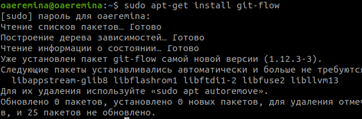{#fig:001 width=70%}

- Установка Node.js

То же самое делаю и для node.js (рис.2)

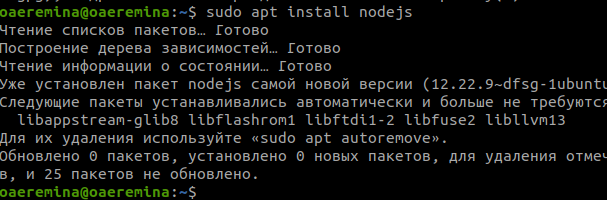{#fig:001 width=70%}

2. Настройка Node.js

Для работы с Node.js добавляю каталог с исполняемыми файлами, устанавливаемыемыми yarn, в переменную PATH (рис. 3)

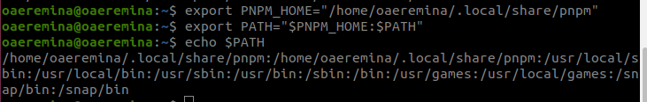{#fig:001 width=70%}

3. Общепринятые коммиты

- commitizen

Данная программа используется для помощи в форматировании коммитов. При этом устанавливается скрипт git-cz, который я буду использовать для коммитов. (рис.4)

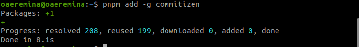{#fig:001 width=70%}

- standard-changelog

Данная программа используется для помощи в создании логов. (рис.5)

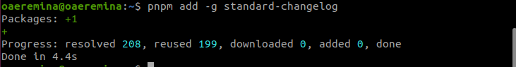{#fig:001 width=70%}

- Практический сценарий использования git

Создаю репозиторий с именем  git-extended. (рис.6)

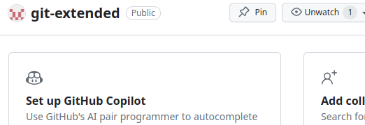{#fig:001 width=70%}

Переходу в папку work и клонирую репозиторий в папку (рис.7)

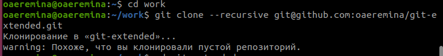{#fig:001 width=70%}

Делаю первый коммит и выкладываю на github. (рис.8)

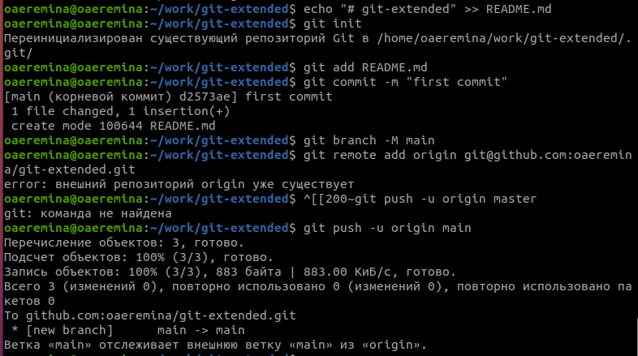{#fig:001 width=70%}

Конфигурация для пакетов Node.js с помощью команды pnpm init (рис.9)

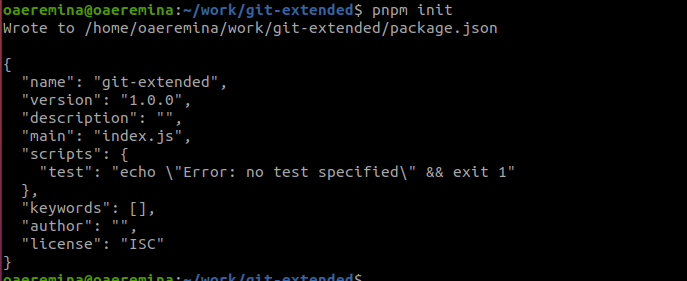{#fig:001 width=70%}

Заполняю несколько параметров пакеты (рис.10)

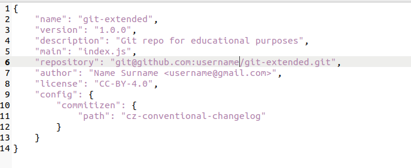{#fig:001 width=70%}

Добавляю новые файлы, выполняю коммит и отправляю на github (рис.11)

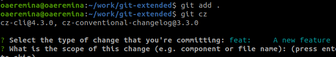{#fig:001 width=70%}

Инициализирую git-flow (рис.12)

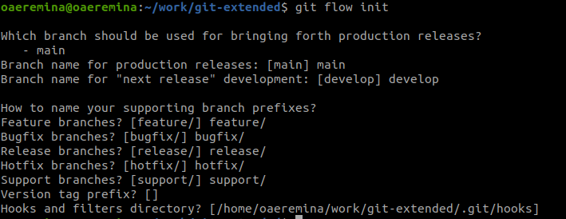{#fig:001 width=70%}

Проверяю, что нахожусь на ветке develop и загружаю весь репозиторий в хранилище (рис.13)

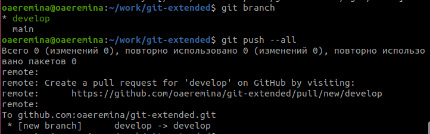{#fig:001 width=70%}

Установливаю внешнюю ветку как вышестоящую для этой ветки (рис.14)

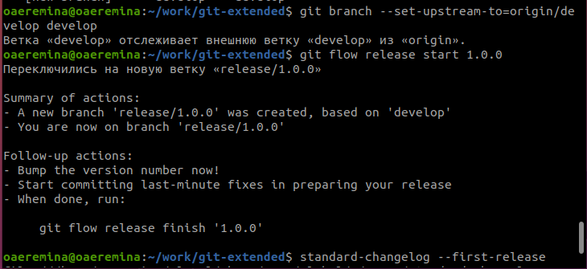{#fig:001 width=70%}

# Выводы

При выполнении данной лабораторной работы я получила практические навыки правильной работы с репозиториями github 

# Список литературы{.unnumbered}

https://esystem.rudn.ru/mod/page/view.php?id=1098794#org363eddd

